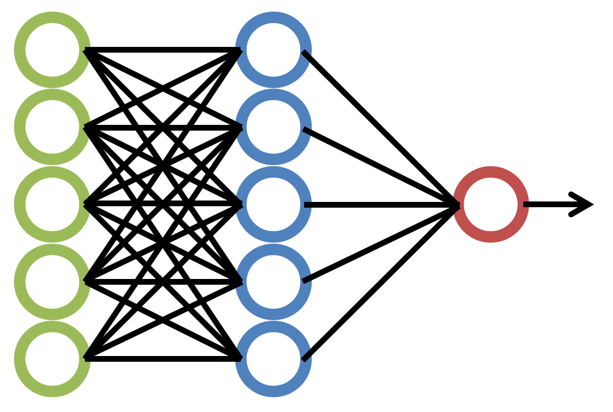

# Neural Network

Neural Network is a series of algorithm which works together to solve a problem by mimicking what a Human Brain would do if put into that same situation.

Before going into more detail of how actual Neural Networks are implemented, let us discuss how our brain works...

## How a Human Brain Works

To put it in a simple way, Human Brain is a collection of a lot of connected Neurons

Here is a Photo of a neuron in brain <a href="https://simple.wikipedia.org/wiki/Neuron#/media/File:Neuron.svg">(Source)</a>

<p align="center"></p>

You can think of the parts of a Neuron as follows:

-   **Dendrite**: The place from where the Neuron Takes Input
-   **Cell Body**: The Place where Neuron processes the Input
-   **Axon**: The Place where the Neuron give it's processed data to next Neuron

Believe it or not, but billions of neurons in you brain works together, to do what we all do.

These Neurons are not so much specialized on what they do (although their collection are, but that is related to Biology) but together they adapt to whatever that is needed to be learnt.

For Example, Researchers at MIT once rewired the Auditory Cortex (the part which make us 'hear'), to the eyes, and the Auditory Cortex itself learnt how to see. For more information, click <a href="https://news.mit.edu/2000/brain">Here</a>.

So it is believed that same things happen in a Neuron, no matter whats it's supposed to do. This is what is mimicked in Artificial Neural Network.

## Artificial Neural Network

An Artificial Neural Network is a collection of "Node" connected together to solve a problem.

Here is a sample image of a Artificial Neural Network <a href="https://commons.wikimedia.org/wiki/Category:Artificial_neural_networks#/media/File:NeuralNetwork.png">(Source)</a>

<p align="center"></p>

Following things are Important to note in the above Diagram:

-   All Circles are called node in the Artificial Neural Network. They Take Inputs, Process them, and give their outputs to the next node

-   The Green nodes are called Input Nodes,

    -   They take input directly from the data to be learned, process them, and give their output to the next layer.
    -   There can only be one Input Layer
    -   All input node collectively takes a vector as input

-   The Blue Nodes are called [Hidden Layer](https://developers.google.com/machine-learning/glossary#hidden-layer)

    -   They inputs from all the nodes from their previous layer, process them, and gives the output to next layer.
    -   There can be many hidden layers

-   The Red node is called the Output Layer

    -   They take input from their previous layer, process them, and give an output, which says what the Neural Network has "thought" of the input given to it.

-   The concept of nodes are just for easier understanding. In algorithm, they are implemented as mathematical formulas

-   All the arrows here are called "data transfer" in algorithm, they are called the learning parameters. The Machine trains itself by tuning these parameters.

-   This type of model is called a **Sequential** Model, and the layers are called **Dense** Layers.

## Where to use this model

This model may solve any problem, which are coded with traditional programming,but they are not used there as they have to be trained to work as intended, which might take a long time to do.

These class of models are used to process the things, which are not easily done by traditional programming methods.

Before moving further let's look at another topic

## Image

_What does Image has to do with Machine Learning?_

Image is one of the popular data, where it's very hard to implement Traditional Programming Methods, This is one of the places where the Neural Network Model Shines.

Before discussing why the Neural Network shines here, lets look why it doesn't work well with traditional programming...

Image is an object which gives us an visual representation of something

Let's take an example of the above image of Neural Network, A human sees it at circles connected via line (for simplicity).

But computer perceives it as follows:

-   A 2D matrix of a 3 number set, which signifies the color at a specific point
-   Each 3 set number is called a pixel

There are many types of Image representation, some of them are:

1. RGB Image

    - Pixel are a set of three numbers, which signifies intensity of Red, Green, and Blue color in the scale of 0-255

2. Binary Image

    - Pixel is a single number, which is either 0 for white and 1 for black

3. Greyscale Image
    - Pixel is a single number ranging from 0-255 which signifies the intensity of black, which 255 being pure black
    - This image is commonly called black and white image (yes, I know it's confusing)

You might wonder why the value 255 is coming so much, this is because generally a pixel is represented by a 8 bit number (or 8\*3 for rgb). Nowadays 10 bit colors are also emerging, which can display a lot of numbers than an 8 bit image. This is called bit depth and to know more, see this <a href="https://www.youtube.com/watch?v=Jcgg7jq1W3o&ab_channel=Techquickie">Video</a>

# Machine Learning with TensorFlow

With All the Introduction out of the way, let's start to understand how to actually implement this Machine using TensorFlow 2

[TensorFlow 2](https://www.tensorflow.org/tutorials/quickstart/beginner) is a open-source platform of Machine Learning, and we can use it to develop Machine Learning Model with relatively less amount of codes than pure mathematical execution. This make it easy for us to understand what's actually happening in big picture, rather than delving into complex mathematical operations. To know more about this platform, Click [Here](https://www.tensorflow.org/)

Along with TensorFlow we also use Matplotlib for Plotting Graphs to Better Understand what's actually going on...

To know more about Matplotlib, click [here](https://matplotlib.org/)

We will be working on MNIST Dataset, This dataset has 70000 data of 28x28 matrices, which is an image of a digit from 0-9

Here is a sample image from the dataset

<p align="center"></p>

## Importing Dataset

This dataset is so common that it's readily available inside the tensorFlow module itself and can be loaded in as follows

```python
    from tensorflow.keras.datasets import mnist
    (x_train,y_train), (x_valid,y_valid) = mnist.load_data()
```

This automatically downloads dataset and divides it into Training and Validation Dataset

Training Dataset is the part by which, the Machine trains itself, and Validation dataset is the part by which we test how good is the prediction of the machine.

y values are the [labels](https://developers.google.com/machine-learning/glossary#label), which tells which digit is it's corresponding x

## Exploring Dataset

We can see the shape of the Training and validation Dataset by the following code...

```python
print(x_train.shape)
```
This will print `(60000, 28, 28)`, signifying that `x_train` has 60000 dataset, each of them are 28x28 matrix

Here's the code to print the image above:

```python
import matplotlib.pyplot as plt
import random

value = random.randint(0,x_train.shape[0])
plt.axis('off')
plt.imshow(x_train[value],cmap='Greys')
print(y_train[value])
```

`random.randint(a,b)` gives a random number between a and b, and `plt.imshow(matrix)` shows the image, `cmap` option here decides which color space to use for displaying. To know more about `imshow()`, click [Here](https://matplotlib.org/stable/api/_as_gen/matplotlib.pyplot.imshow.html)

### Flattening Dataset

The Machine can't take 28x28 array as an input, as we saw that it takes a Vector or 1D array as input. So we [reshape](https://www.tensorflow.org/api_docs/python/tf/reshape) them to 784 element 1D array (28*28 = 784), by the following code...

```python
x_train = x_train.reshape(x_train.shape[0],x_train.shape[1]*x_train.shape[2])
x_valid = x_valid.reshape(x_valid.shape[0],x_valid.shape[1]*x_valid.shape[2])

print(x_train.shape)
print(x_valid.shape)
```

This will print `(60000, 784)` and `(10000, 784)`, signifying that 28x28 2D matrix has been converted to 784 1D matrix. This is called _flattening_ the images.

## Normalizing Dataset

The TensorFlow model, which we are going to use requires input values to be in the range 0-1, so we need to  convert the images range 0-255 to 0-1, we do it by the following...

```python
x_train = x_train / 255
x_valid = x_valid / 255
```

This step is called [Normalization](https://developers.google.com/machine-learning/glossary#normalization)


## Categorical Encoding

The `y_train` and `y_valid` are a number ranging from 0-9 , but as the model will be working in float values between 0 and 1, and can only give outputs in that range, so what we do is that we convert `y_train` and `y_valid` to a set of 10 numbers with following property

-   i<sup>th</sup> value of y_train will be 1 if y_train was i

This was super simplified as only one data point was in question, in reality we have to convert an n size dataset of output to nxm size dataset, where m is the max value of y. This is called Categorical Encoding.

Luckily TensorFlow has built-in function [`to_categorical`](https://www.tensorflow.org/api_docs/python/tf/keras/utils/to_categorical) for this, which is done by following code...

```python
import tensorflow.keras as keras

num_category = 10

y_train = keras.utils.to_categorical(y_train,num_category)
y_valid = keras.utils.to_categorical(y_valid,num_category)
```

Now we have the data set up as needed, we can now proceed to building the model...

## Building the Model

The Build will be as follows:
-   We build a [_Sequential Model_](https://www.tensorflow.org/api_docs/python/tf/keras/Sequential)
-   784 nodes for input layer
-   A single hidden layer with 512 nodes
-   10 outputs layers each having a probability that what digit it is
-   All layers will be [_Dense_](https://www.tensorflow.org/api_docs/python/tf/keras/layers/Dense)

All this can be done in the following codes

```python
from tensorflow.keras.models import Sequential
from tensorflow.keras.layers import Dense

model = Sequential()


model.add(Dense(units=784,activation='relu',input_shape=(784,)))
model.add(Dense(units=512,activation='relu'))
model.add(Dense(units=10,activation='softmax'))

model.compile(loss='categorical_crossentropy',metrics=['accuracy'])
```

Here the words `relu`, `softmax`, and `categorical_crossentropy` are purely mathematical terms, which I will not be explaining right now, I you wanna know more about [ReLu](https://machinelearningmastery.com/rectified-linear-activation-function-for-deep-learning-neural-networks/), [Softmax](https://en.wikipedia.org/wiki/Softmax_function), and [Categorical Cross-Entropy](https://gombru.github.io/2018/05/23/cross_entropy_loss/), click the respective links.

What I will say that `softmax` makes sure that outputs nodes will be probabilistic value, i.e sum of all the output node's output will be one. This makes determining the best guess easier than not using softmax.

## Training the Model

The Model Formed can be trained by the following code...

```python
history = model.fit(x_train,y_train,epochs=20,verbose=1,validation_data=(x_valid,y_valid))
```

Here  `epochs` means number of time to train the model, One Epoch means a full pass of the data set.

This Outputs `history`, which contains all the evaluation parameters for all the epochs.

## Analyzing Output

we can find what data `history` has by following...

```python
history.history.keys()
```

This Outputs `dict_keys(['loss', 'accuracy', 'val_loss', 'val_accuracy'])`, which says that `history.history` is a dictionary data structure with the given four parameters.

To plot the data in `history`, we do the following...

```python
import matplotlib.pyplot as plt

fig,(ax1,ax2) = plt.subplots(1,2)
fig.set_size_inches(20,8)

fig.suptitle('Metrics Of Neural Network')

ax1.plot(history.history['loss'])
ax1.plot(history.history['val_loss'])
ax1.legend(['loss','val_loss'])
ax1.set_title('Loss')

ax2.plot(history.history['accuracy'])
ax2.plot(history.history['val_accuracy'])
ax2.legend(['accuracy','val_accuracy'])
ax2.set_title('Accuracy')
```

This Shows the following two graphs...

<p align="center"></p>

Here we see that as the epochs gets continued, although training loss keeps getting decreased and training accuracy keeps increasing (the blue lines), the Validation Loss keep increasing, and Validation Accuracy keeps decreasing. 

This means that the model will give very good results with the models he has already seen, but perform poorly on new data. This is a very bad thing and should be avoided. This is called the Problem of Overfitting.

# Conclusion

I have also provided a .ipynb file [here](https://github.com/Abhiroop25902/Algorithms/blob/ML-Neural-Network-Colab-link-Fix/src/MachineLearningAlgorithms/Deep_Learning/Neural_Network/fashion_MNIST.ipynb), I you wanna see the codes in action.

Hope you have found my guide informative. 😄
