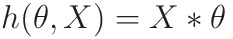
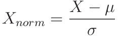
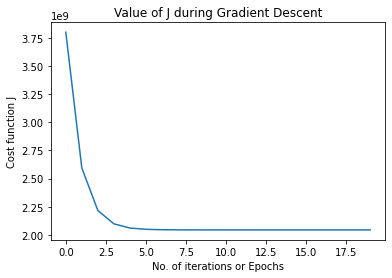

# Linear Regression with Multiple Variable

This is the python version of Linear Regression, most of this is converted from octave/matlab code of the Stanford Machine Learning Course from Coursera

This will be purely Mathematical and Algorithmic

Importing required libraries...

```python
import numpy as np
import matplotlib.pyplot as plt
```

## Functions to be used...

Let's first define the functions that will be called in actual code...

### Hypothesis function

Outputs Y, Given X, by parameter &theta;

<p align="center"></p>

-   m -> number of elements in the dataset
-   n -> no. of features of a data (in this example 2)
-   X -> m x (n+1) matrix
    -   +1 as we have concatenated 1 so as to keep &theta;<sub>0</sub> as constant
-   &theta; -> (n+1) x 1 matrix
-   Outputs mx1 matrix

```python
def hypothesis(x, theta):
    '''calculates the hypothesis function'''
    return np.matmul(x, theta)
```

### Cost Function

This essentially calculates the distance between what we need the line to be, and what it actually is:

-   Vector Form for faster implementation
    -   m -> number of elements in the dataset
    -   h(&theta;, X) and Y -> mx1 matrix
    -   Outputs 1x1 matrix

<p align="center"></p>

```python
def compute_cost(x, y, theta):
    '''outputs the cost function'''
    m = len(y)
    error = hypothesis(x, theta) - y
    error_square_summed = np.matmul(np.transpose(error), error)
    return 1/(2*m)*error_square_summed
```

### Gradient Descent

Gradient Descent is an iterative way through which we can minimize the cost function J(&theta;,x), which essentially depends on the values of &theta;<sub>0</sub> and &theta;<sub>1</sub>

This algorithm iteratively minimizes J(&theta; ,x) to reach it's minimum possible value

-   Vector Implementation to speed up Algorithm:
    -   m -> dataset size
    -   n -> no. of features of a data (in this example 2)
    -   X -> m x (n+1) matrix
    -   h(&theta;, X) and Y -> mx1 matrix
    -   &theta; -> (n+1) x 1 matrix

<p align="center"></p>

```python
def gradient_descent(x, y, theta, alpha, num_iter):
    '''Performs Gradient Descent and outputs minimized theta and history of cost_functions'''
    m = len(y)
    J_history = np.zeros((num_iter, 1))

    for iter in range(num_iter):
        h = hypothesis(x, theta)
        error = h-y
        partial_derivative = 1/m * np.matmul(np.transpose(x), error)
        theta = theta - alpha*partial_derivative

        J_history[iter] = compute_cost(x, y, theta)

    return theta, J_history
```

### Normalization

As Features of X might be skewed, it is safer to normalize the features of X to same range, this reduces error, and also make learning faster

<p align="center"></p>

-   X -> m x n matrix <mark>(note there is no +1)</mark>
-   &mu; -> 1 x n matrix, mean of the features of X
-   &sigma; -> 1 x n matrix, standard deviation of the features of X

This essentially converts all values of a feature in the range (-1,1)

```python
def featureNormalize(X):
    mu = np.mean(X,axis=0)
    sigma = np.std(X,axis=0)
    X_norm = (X-mu)/sigma
    return X_norm,mu,sigma
```

### Predict

Uses hypothesis() to predict value of new input

```python
def predict(value, minimized_theta,mu,sigma):
    value = np.array(value)
    mu = np.array(mu)
    sigma = np.array(sigma)


    mu = mu.reshape(1,mu.shape[0])
    sigma = sigma.reshape(1,sigma.shape[0])

    normalized_value =  (value -mu)/sigma
    one = np.array([[1]])
    x_array = np.concatenate((one,normalized_value),axis=1)
    return hypothesis(x_array,minimized_theta)
```

## Processing

Loading Data from `ex1data2.txt`

The `ex1data2.txt` contains a training set of housing prices in Port-
land, Oregon. The first column is the size of the house (in square feet), the second column is the number of bedrooms, and the third column is the price of the house.

```python
data_path = "./ex1data2.txt"
data = np.loadtxt(data_path, delimiter=',')
```

### Extracting Population and Profits from data

```python
# first value is independent variable x, second is dependant y
X= data[:, 0:2]
Y = data[:, 2]
```

### Printing Some Data Points

```python
print("First 10 examples from the dataset")

for iter in range(10):
    print(f"X = {X[iter]}, Y = {Y[iter]}")
```

### Normalizing

By looking in the value of X, we see that value are not in same range, so we normalize the value of X so that the learning becomes more accurate and fast

while predicting, model will give normalized output, we need to de-normalize it

```python
X,mu,sigma = featureNormalize(X)
```

### Adding ones to X and changing y from vector to 2D array

```python
#adding ones to X
dataset_size = X.shape[0]
ones = np.ones(dataset_size).reshape(dataset_size,1)
X = np.concatenate((ones,X),axis=1)

Y = Y.reshape(dataset_size,1)

print(X.shape)
```

### Running Gradient Descent

```python
print("Running Gradient Descent ...\n")
alpha = 1
num_iter = 10
theta = np.zeros((X.shape[1],1))
minimized_theta, J_history = gradient_descent(X, Y, theta, alpha, num_iter)

print("Theta found by gradient descent:")
print(minimized_theta)
```

### Plotting Value of J during Gradient Descent 

This should Decrease with Epochs

```python
plt.figure("Value of J during Gradient Descent")
plt.title('Value of J during Gradient Descent')
x_axis = range(len(J_history))
plt.xlabel('No. of iterations or Epochs')
plt.ylabel("Cost function J")
plt.plot(x_axis,J_history)
```

This will give a graph like this...

<p align="center"></p>

### Estimate

Estimate the price of a 1650 sq-ft, 3 bedroom house

```python
predict_input = np.array([1650,3])
predict_input = predict_input.reshape(1,predict_input.shape[0])

print(f"Predicted Price of a 1650 sq-ft, 3 bedroom house: {predict(predict_input,minimized_theta,mu,sigma)}")
```


