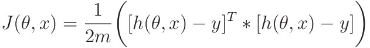
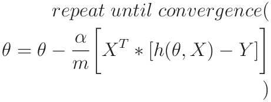

# Linear Regression with one Variable

This is the python version of Linear Regression, most of this is converted from octave/matlab code of the Stanford Machine Learning Course from Coursera

This will be purely Mathematical and Algorithmic

Importing required libraries...

```python
import numpy as np
import matplotlib.pyplot as plt
import time
```

## Functions to be used...

Let's first define the functions that will be called in actual code...

### Hypothesis function

Outputs Y, Given X, by parameter &theta;

1. In Simple Definition:

<p align="center"></p>

2. In Vector Form:

<p align="center"></p>

-   m -> number of elements in the dataset
-   X -> mx2 matrix
-   &theta; -> 2x1 matrix
-   m -> dataset size
-   Outputs mx2 matrix

Vector Form is implemented here for faster Operation.


```python
def hypothesis(x, theta):
    '''calculates the hypothesis function'''
    return np.matmul(x, theta)
```

### Cost Function

This essentially calculates the distance between what we need the line to be, and what it actually is:


1. Definition:
    -   m -> number of elements in the dataset
    -   x<sup>(i)</sup> -> value of x in i<sup>th</sup> data point
    -   y<sup>(i)</sup> -> value of y in i<sup>th</sup> data point

<p align="center"></p>

2. Vector Form for faster implementation
    -   m -> number of elements in the dataset
    -   h(&theta;, X) and Y -> mx1 matrix
    -   Outputs 1x1 matrix

<p align="center"></p>

```python
def compute_cost(x, y, theta):
    '''outputs the cost function'''
    m = len(y)
    error = hypothesis(x, theta) - y
    error_square_summed = np.matmul(np.transpose(error), error)
    return 1/(2*m)*error_square_summed
```

### Gradient Descent

Gradient Descent is an iterative way through which we can minimize the cost function J(&theta;,x), which essentially depends on the values of &theta;<sub>0</sub> and &theta;<sub>1</sub>

Gradient Descent is implemented as follows:

<p align="center"></p>

where

1.  &alpha; -> a constant, also called learning rate of algorithm
2.  &theta;<sub>j</sub> -> j<sup>th</sup> value of &theta;
3.  J( &theta;<sub>0</sub> , &theta;<sub>1</sub> ) -> The Cost Function

This algorithm iteratively minimizes J(&theta; ,x) to reach it's minimum possible value

- Vector Implementation to speed up Algorithm: 
    -   m -> dataset size
    -   X -> mx2 matrix
    -   h(&theta;, X) and Y -> mx1 matrix

<p align="center"></p>

```python
def gradient_descent(x, y, theta, alpha, num_iter):
    '''Performs Gradient Descent and outputs minimized theta and history of cost_functions'''
    m = len(y)
    J_history = np.zeros((num_iter, 1))

    for iter in range(num_iter):
        h = hypothesis(x, theta)
        error = h-y
        partial_derivative = 1/m * np.matmul(np.transpose(x), error)
        theta = theta - alpha*partial_derivative

        J_history[iter] = compute_cost(x, y, theta)

    return theta, J_history
```

### Predict 
 
 uses hypothesis() to predict value of new input

```python
def predict(value, theta):
    x_array = [1, value]
    return hypothesis(x_array,theta)
```

Now Let's start the actual processing

## Processing

### Loading Data from ex1data1.txt

In each line, first value is 'Population of City in 10,000s' and second value is 'Profit in $10,000s'

```python
data_path = "./ex1data1.txt"
data = np.loadtxt(data_path, delimiter=',')
```

###  Extracting Population and Profits from data

```python
# first value is independent variable x, second is dependant y
independent_x = data[:, 0]
dependant_y = data[:, 1]
```

### Plotting the Scatter-Plot of data

```python
# showing data
print("Plotting Data ...\n")
plt.figure("Scatter Plot Visualization of Data")
plt.title("Scatter Plot Visualization of Data")
plt.scatter(independent_x, dependant_y, marker="x", c="r")
plt.ylabel('Profit in $10,000s')
plt.xlabel('Population of City in 10,000s')
```
These lines of codes output this graph

<p align="center"></p>

### Converting x and y in matrix form

as x and y are 1D vector, they have to converted to their respective matrix form

Also as we are about to do a Matrix Multiplication, to simulate h<sub>&theta;</sub>(x) = &theta;<sub>0</sub> + &theta;<sub>1</sub> * x , we are appending 1 to every rows of x to simulate addition of &theta;<sub>0</sub> by matrix multiplication.

```python
# as we are going to use matrix multiplication, we need x as first column 1, second column values
dataset_size = independent_x.shape[0]
ones = np.ones(dataset_size)
x = np.stack((ones, independent_x), axis=1)

# also converting y in vector form to matrix form
y = dependant_y.reshape(len(dependant_y), 1)
```

### Testing hypothesis and cost function with sample inputs

```python
# initializing theta
theta = np.zeros((2, 1))
alpha = 0.01
num_iter = 1500

print("Testing the cost function ...")
print(f"with theta = [[0],[0]] \nCost computed = {compute_cost(x,y,theta)}")
print("Expected cost value (approx) 32.07\n")

print(f"with theta = [[-1],[2]] \nCost computed = {compute_cost(x,y,[[-1],[2]])}")
print("Expected cost value (approx) 54.24\n")
```

### Running Gradient Descent

```python
print("Running Gradient Descent ...\n")
minimized_theta, J_history = gradient_descent(x, y, theta, alpha, num_iter)
```

### Plotting Value of J during Gradient Descent 

If there is value of &alpha; is not high, this should decrease with epochs

```python
plt.figure("Value of J during Gradient Descent")
plt.title('Value of J during Gradient Descent')
x_axis = range(len(J_history))
plt.xlabel('No. of iterations or Epochs')
plt.ylabel("Cost function J")
plt.plot(x_axis,J_history)
```
A sample graph generated from this...

<p align="center"></p>

### Testing Minimized Theta

```python
print("Theta found by gradient descent:")
print(minimized_theta)
print("Expected theta values (approx)")
print("  3.6303\n  1.1664\n")
```

### Predicting Value for new Inputs

```python
print(f"For population = 35,000, we predict a profit of {predict(3.5, minimized_theta)*10000}")
print(f"For population = 70,000, we predict a profit of {predict(7, minimized_theta)*10000}")
```

### Plotting Scatterplot and the Line of Hypothesis

```python
plt.figure("Linear Regression Result")
plt.title("Linear Regression Result")
plt.scatter(independent_x, dependant_y, marker="x", c="r")
plt.plot(x[:, 1], hypothesis(x, minimized_theta))
plt.ylabel('Profit in $10,000s')
plt.xlabel('Population of City in 10,000s')
plt.show()
```

A Sample graph from the above code...

<p align="center"></p>

# Conclusion

